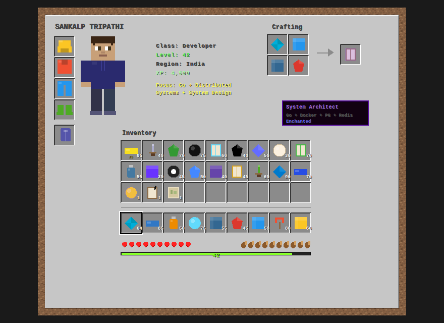
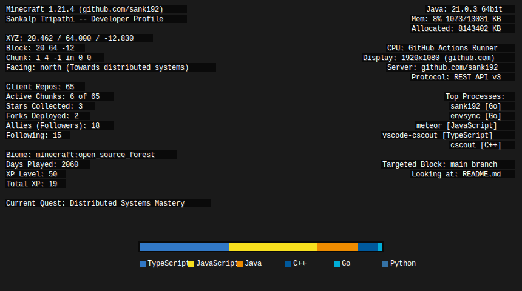

  

  

 

 

&nbsp;<b>[Server] Recent Activity Log</b>

 

<!--START_SECTION:activity-->
1. 🎉 Merged PR [#14079](https://github.com/meteor/meteor/pull/14079) in [meteor/meteor](https://github.com/meteor/meteor)
2. 🎉 Merged PR [#14058](https://github.com/meteor/meteor/pull/14058) in [meteor/meteor](https://github.com/meteor/meteor)
3. 🎉 Merged PR [#14150](https://github.com/meteor/meteor/pull/14150) in [meteor/meteor](https://github.com/meteor/meteor)
4. 🗣 Commented on [#82](https://github.com/dspinellis/cscout/issues/82#issuecomment-4062395629) in [dspinellis/cscout](https://github.com/dspinellis/cscout)
5. 🗣 Commented on [#82](https://github.com/dspinellis/cscout/issues/82#issuecomment-4056649262) in [dspinellis/cscout](https://github.com/dspinellis/cscout)
<!--END_SECTION:activity-->

 

&nbsp;
&nbsp;

 

  

